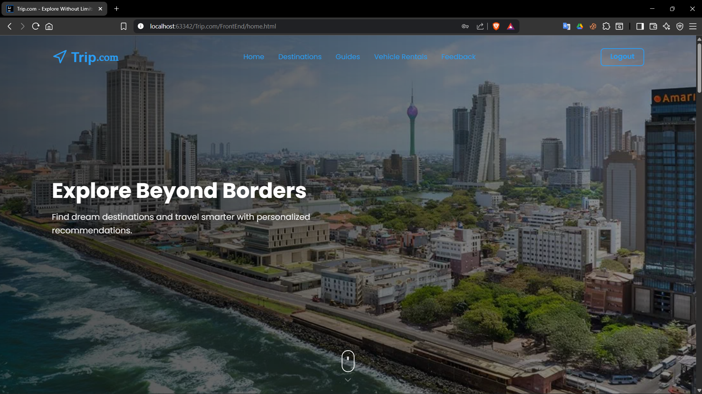
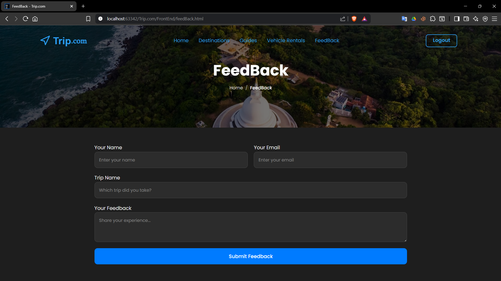
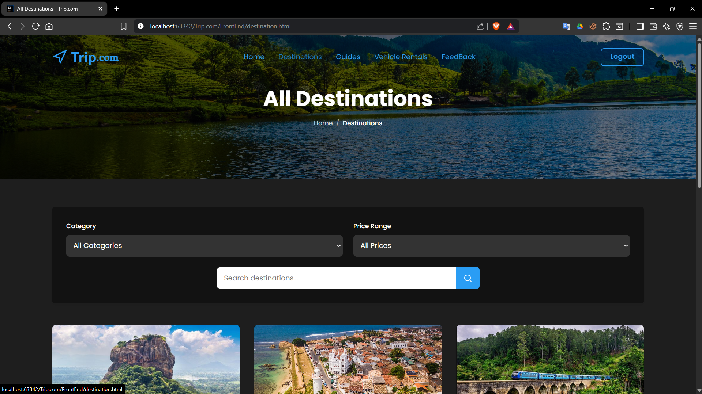
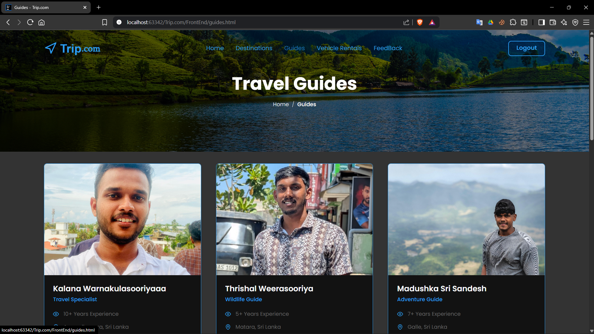
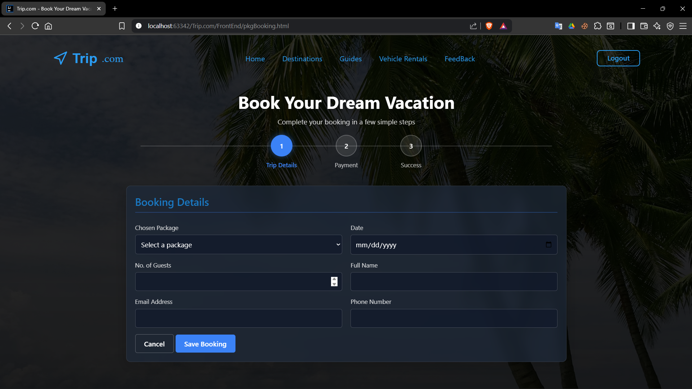
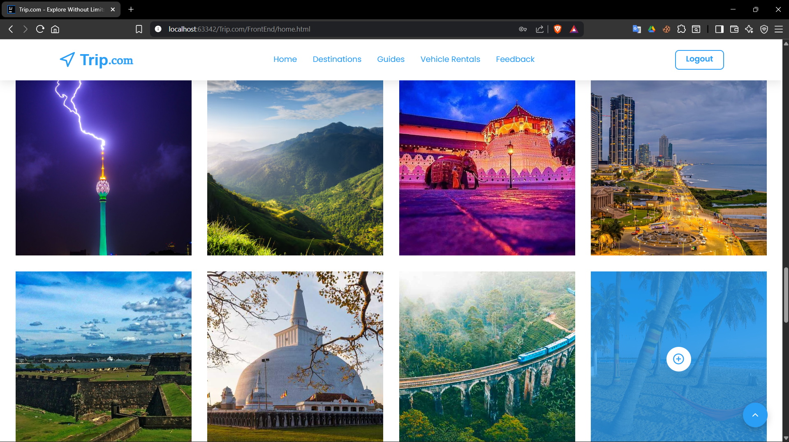
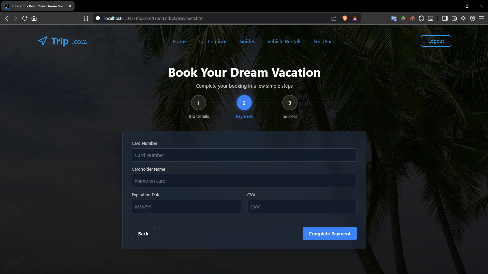
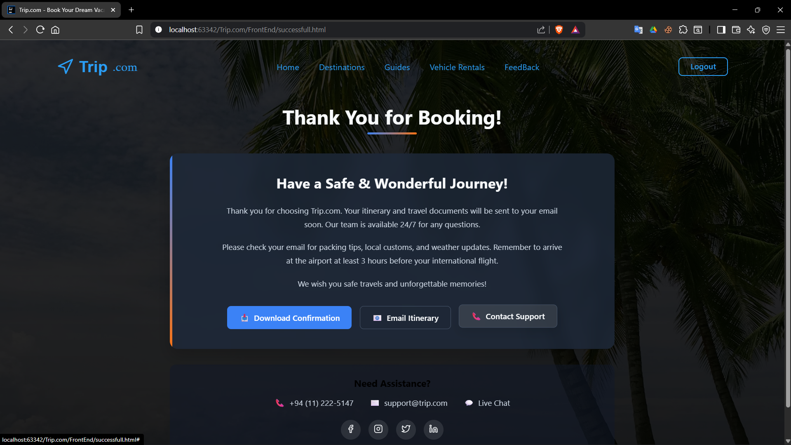
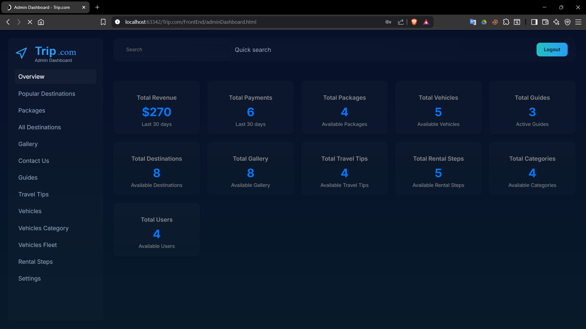

# 🌍 Trip.com Project | Travel & Tour Management System

## 📖 Project Description
The **Trip.com Project** is a Travel & Tour Management System designed to streamline the process of managing travel packages, destinations, guides, vehicles, customers, and bookings.  
It provides an all-in-one solution for travel agencies to handle reservations, payments, and customer interactions with ease.  

### ✨ Key Features
- 🧭 Destination & Tour Guide Management  
- 🧳 Travel Package Handling  
- 📅 Booking & Scheduling System  
- 👨‍💻 User Authentication & Role-Based Access  
- 💳 Secure Payment Processing  
- 🚗 Vehicle & Service Management  

---

## 📸 Screenshots

### 🏠 Home Page


### 📊 Interface


### FeedBack


### Destination


### Vehicle


### Guides


### Booking


### 📋 Packages


### 📋 Gallery


### Payment


### Success


### 📋 Admin Dashboard


---

## ⚙️ Setup Instructions

### 🔹 Prerequisites
- Java 
- Maven
- Spring Boot
- CSS
- HTML
- MySQL 

### 🔹 Backend Setup (Spring Boot)
1. Clone the repository:
   ```bash
   git clone https://github.com/kalanaCwarnakulasooriya/Trip.com.git
   cd tripcom-project/backend
